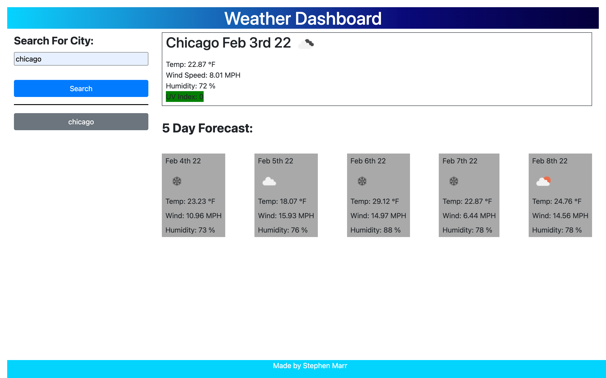

# weatherApp

## Description

This is a Weather Application where you can put in any city in america and recieve the current weather, wind speed, humidity, and uv index. as well as it will show a 5 day forecast.

On this page you will see a user input textbox where you can type in the name of your city. this will then populate the right side of the page with current weather information as well as 5 boxes underneath for the 5 day forecast. a search history will populate underneath the search city inbox with individual boxes of each city you searched and when clicked it will go back to that cities current weather and 5 day forecast.

## Screenshot

## Links to Application

- Here is the link to the repo: [smarr2198/repo](https://github.com/smarr2198/weatherApp)
- Here is the link to the pages: [smarr2198/pages](https://smarr2198.github.io/weatherApp/)
